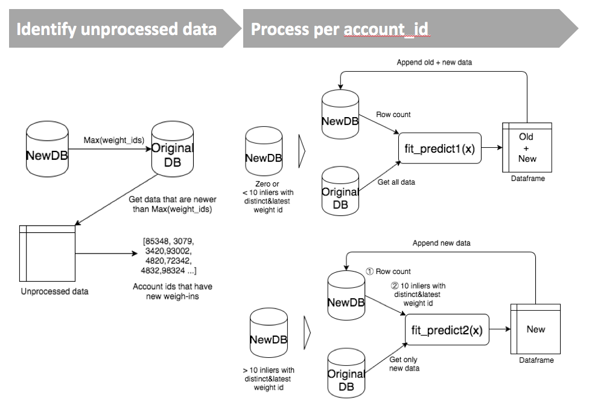
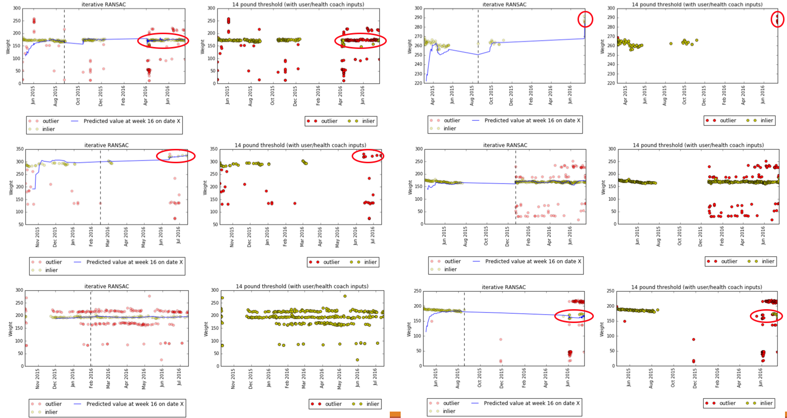

Iterative RANSAC regression algorithm specifically for outlier detection and prediction of weigh-ins from smart scales.
=========
The robust algorithm is useful if the data includes multiple trends (for example, X number of family members use the scale) or a lot of outliers. The algorithm is specifically designed for weight log data sent from smart scale. 

# Algorithm (how it works)
__1 to 3 is to prepare the first window to fit the model. 4 to 6 is to iteratively update the window for preparing training data and predicting the next points__

1. It compares current weight (w(t)) and previous weight (w(t-1)) and if the difference is more than x threshold, it will be labeled as outlier, otherwise inlier (The confirmed weight is used as w(t-1) for the first weigh-in)
2. If there is zero or one inlier in the given x window size or the first 5 consecutive weigh-ins are not inlier, it runs (1) again with the median of x window size instead of the confirmed weight
3. It then checks the de-trended residual standard deviation (RSTD) and if RSTD is less than y (=3 with the data used) threshold, it is likely that the set does not include outliers. Otherwise, it will compare each residual with RSTD and if the difference is more than x threshold, the data point will be labeled as an outlier. (de-trended using linear least-squares)
4. It then filters all the inlier points in the window and use the latest x points to fit RANSAC.
5. RANSAC then predicts w(t+1) and compare if the residual of observed w(t+1) and predicted w(t+1) is less than x*RSTD 
6. Iterate 4 and 5

### RANSAC (used inside the algorithm)
1. Select a random subset of the original data (called _hypothetical inliers_)
2. A model is fitted to the set of hypothetical inliers
3. The rest of the dataset will then be tested against the fitted model. Those points that fit the estimated model well (according to some model-specific loss function) are considered as part of the _consensus set_. (The estimated model will be reasonably good if sufficiently many points have been classified as part of the _consensus set_)
4. Iterate over 1-3 and pick the best fitting model

In addition to above, I added some more conditional logics:
- added conditional logics for best estimating the initial weight data point
- added a function to keep track of number of days passed since the first weigh-in date. This value will be the input data for regression model and it enables the model to predict a specific point in future time. 
- added a function to take care of the uncertainty of unseen future weight data (absence of inliers) by incrementally increasing the threshold. 

###Note:
- You can change parameters and set up database access in `config.py` file. 
- This module is built with Python 2.

## How To Install
Although the design of this package is very specific, you could modify the code (`algorithm.py` and `db_job.py`) to  fit your cases.    
1. Clone this repo and cd into its directory.  
2. run: `pip install -r requirements.txt && python setup.py install` in your shell. This should install all the necessary libraries. 

## Data Flow Design

## Sample Results

